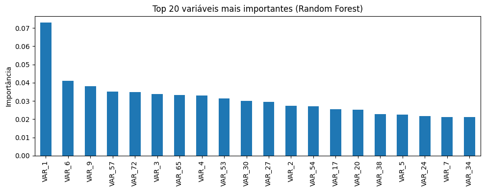

# 🧠 3. Modelagem e Seleção Final do Modelo

Esta seção detalha o **pré-processamento final das features**, a seleção de variáveis baseada em importância e a avaliação comparativa de diferentes algoritmos de Machine Learning.

---

## 3.1. 🔬 Pré-processamento e Pipelines

Todas as 47 features restantes foram submetidas a um Pipeline de pré-processamento padrão:

>**Imputação de Missing Values:** Utilização da mediana para preencher valores ausentes nas variáveis numéricas e moda nas variáveis categóricas.
>
>**Padronização (StandardScaler e One-Hot Encoding):** Aplicação do StandardScaler para normalizar as features númericas e One-Hot Encoding para as features categóricas.

---

## 3.2. 🌳 Seleção Final de Variáveis (Random Forest)

Para refinar o modelo e reduzir a complexidade e o risco de overfitting, foi utilizado um modelo Random Forest para ranquear as features por importância (Feature Importance).

Objetivo: Selecionar as Top K=20 variáveis que mais contribuem para a separação entre _Bons_ e _Maus Pagadores_.

O dataset para o treinamento final foi **reduzido de 47 para 20 features**, focado nas variáveis com maior _poder preditivo_.

---

## 3.3. 🆚 Avaliação Comparativa de Modelos (Cross-Validation)

Quatro modelos foram comparados utilizando Cross-Validation Estratificada (5 splits) no conjunto de Treino (X_train_sel).

### 3.3.1. Métricas de Desempenho

Em Credit Scoring, as métricas de ranking são priorizadas:

>**AUC (Area Under the Curve):** Probabilidade de o modelo ranquear um par aleatório (Mau Pagador, Bom Pagador) na ordem correta. 
>
>**Gini Coefficient:** Mede a separação das distribuições.
>
>**KS (Kolmogorov-Smirnov):** Mede a separação máxima entre as distribuições acumuladas de _Bons_ e _Maus Pagadores_.

| Modelo | KS Médio | KS Desvio | AUC Médio | AUC Desvio | Gini Médio | Gini Desvio |
| :--- | :---: | :---: | :---: | :---: | :---: | :---: |
| **LightGBM** | **0.447** | 0.022 | **0.796** | 0.011 | **0.593** | 0.022 |
| Logistic Regression | 0.424 | 0.013 | 0.786 | 0.011 | 0.571 | 0.022 |
| Random Forest | 0.433 | 0.019 | 0.785 | 0.009 | 0.569 | 0.017 |
| XGBoost | 0.424 | 0.034 | 0.783 | 0.015 | 0.566 | 0.029 |

**Conclusão do Treino:** O LightGBM demonstrou o melhor desempenho preditivo bruto, estabelecendo o teto da performance com o maior AUC (0.796) e Gini (0.593). A Regressão Logística e o Random Forest se mostraram altamente competitivos, ficando a menos de 1 ponto percentual de distância no AUC.

---

## 3.4. 🛡️ Validação Final (Teste OOT)

A performance de cada modelo foi avaliada no conjunto de **Teste (Out-of-Time - OOT)**, que representa o ambiente de risco futuro. A estabilidade é medida pela capacidade do modelo de reter seu poder preditivo em dados futuros (OOT).

| Modelo | KS | AUC | Gini |
| :--- | :---: | :---: | :---: |
| **LightGBM** | **0.306** | **0.704** | **0.407** |
| Logistic Regression | 0.294 | 0.701 | 0.402 |
| Random Forest | 0.265 | 0.685 | 0.369 |
| XGBoost | 0.255 | 0.668 | 0.337 |

**Conclusão:** Devido a sua performance superior, o **LightGBM é o modelo escolhido para o Credit Scoring final.**

---