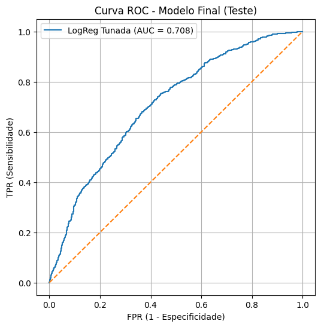
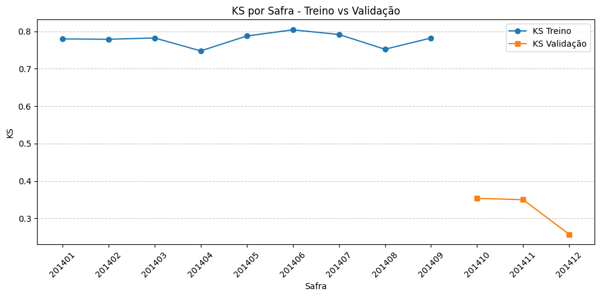

# 5. 🚀 Validação do Modelo Final (LightGBM)

Esta fase consolida a **performance do modelo LightGBM tunado**, analisando em profundidade a separação de risco (ROC/KS), a distribuição do score (Taxa de Evento por Quantil) e a calibração da probabilidade de default no conjunto de Teste OOT.

---

## 5.1. 📊 Métricas de Desempenho Finais

O modelo final (LightGBM) foi avaliado em ambos os conjuntos.

| Base | AUC | KS | Gini | Accuracy | Precision | Recall | F1 |
| :--- | :---: | :---: | :---: | :---: | :---: | :---: | :---: |
| **Treino** | 0.954 | 0.766 | 0.908 | 0.878 | 0.904 | 0.634 | 0.745 |
| **Teste (OOT)** | **0.708** | **0.314** | **0.417** | 0.694 | 0.589 | 0.159 | 0.250 |

A alta performance no Treino (AUC = 0.95) comparada à performance no Teste OOT (AUC = 0.708) demonstra um alto grau de **overfitting**, comum em modelos de ensemble que buscam a máxima acurácia. No entanto, o AUC de 0.708 no OOT confirma que o modelo **reteve um poder de separação** de risco robusto.

---

## 5.2. 📊 Curvas de Ranqueamento

### 5.2.1. Curva ROC:

A Curva ROC no Teste OOT confirma o poder de ranqueamento, com um AUC de 0.708.

### 5.2.2. Curva KS:

O KS Score de 0.314 indica que a separação máxima entre a distribuição acumulada de Bons e Maus Pagadores é de 31.4%, um resultado satisfatório.

---

## 5.3. 📉 Taxa de Evento por Quantil (Lift Analysis)

A análise por quantis (decis) é a tradução mais direta do poder de ranqueamento para o negócio, mostrando a concentração de risco.

O gráfico de Taxa de Evento compara a frequência observada de default por faixas de score (quantis) no Treino e no Teste OOT.

---

## 5.4. ⚖️ Estabilidade Temporal do KS e Calibração

**KS por Safra**

A análise do KS mês a mês (por safra) é a verificação mais rigorosa da estabilidade preditiva ao longo do tempo.

**Nota:** O KS no Teste OOT (safras 10/2014 a 12/2014) mostra uma queda de performance na última safra (12/2014) (KS = 0.258). Isso pode ser um sinal de forte drift de mercado ou mudança de política de crédito recente, exigindo monitoramento imediato.

**Curva de Calibração**

A curva de calibração verifica se a probabilidade prevista (P(Default)) corresponde à frequência real de default observada.

